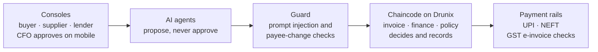
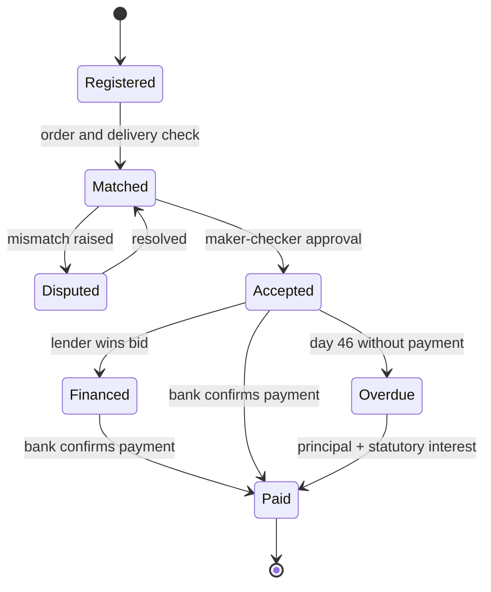
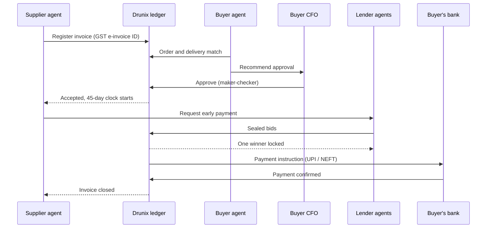

# PactNet

**Agent-to-agent B2B invoice approval, financing and settlement on Drunix.**

Drunix Hackathon (Citi × NPCI) · Track 1: Real-Time Payments

**Agents propose · Humans approve · Chaincode decides**

---

## 1. Problem statement

Indian MSMEs wait months to get paid.

| | |
|---|---|
| **₹55,244 crore** | claimed across 2,56,892 delayed-payment cases on the MSME Samadhaan portal (June 2026) |
| **22.6%** | of those cases resolved (58,148). More than three in four are still waiting. |

The law already says pay within 45 days. Under the MSMED Act, buyers who pay micro and small suppliers late owe compound interest at three times the RBI bank rate. But claims are slow and costly, and suing a buyer ends the relationship.

What's missing is a shared, trusted record of:

- when an invoice was accepted,
- whether it's already financed, and
- where the payment stands.

## 2. Solution

PactNet is a network on Drunix. AI agents for buyers, suppliers and lenders approve, finance and settle B2B invoices on it, all on one ledger that every party trusts.

| Agent | Role | What it does |
|---|---|---|
| Buyer agent | Payables | Checks invoices against the order and delivery, and suggests when to pay |
| Supplier agent | Receivables | Tracks what the supplier is owed and asks for early payment |
| Lender agents | Financing | Price approved invoices and bid to fund them early |
| Guard | Security | Stops fake bank-change requests and prompt-injection tricks |

No agent can move money. Agents propose, people approve under company policy, and chaincode on the ledger decides.

## 3. Architecture

Every request takes one guarded path:

### Drunix network

Drunix is NPCI's open-source, enhanced fork of Hyperledger Fabric.

| Organisation | Role | Sees |
|---|---|---|
| Buyer | Peer | Its invoices, approvals, cash forecast |
| Supplier (MSME) | Peer | Its invoices, acceptance, financing offers |
| Buyer's bank | Peer | Settlement instructions; signs payment confirmations |
| Lender A, Lender B | Peers | Invoices open for funding; only their own bids |
| GST e-invoice system | Observer | Invoice ID hashes only |
| MSEFC | Observer | Overdue invoices and interest owed |

Private data collections hold prices, KYC and loan terms. The shared ledger holds invoice state and hashes.

### Chaincode

| Chaincode | Responsibility |
|---|---|
| `invoice` | One record per GST e-invoice ID (duplicates rejected), match evidence, acceptance, disputes, MSMED Act interest |
| `finance` | Sealed-bid funding auction, one lender per invoice, settlement routed to whoever is owed |
| `policy` | Maker-checker approvals and per-agent authority limits |

Key design choices:

- **Deterministic.** Chaincode uses transaction timestamps, never a local clock, and makes no external calls. Interest is computed from the on-ledger acceptance time.
- **Sealed bids.** Lenders commit a hash of their bid and keep the bid in their own private data collection until the reveal. Each bid has its own key, so concurrent bids never collide.
- **Key-level endorsement.** After acceptance, changes need buyer and supplier signatures. After financing, the lender's too.
- **Bank-confirmed payment.** Only a transaction signed by the buyer's bank, carrying the payment reference hash, marks an invoice Paid.
- **Payee binding.** A supplier's bank account is bound to its GSTIN; changing it needs the supplier's own signature.
- **Agent identity.** Each agent has its own certificate with authority limits. Revoking the certificate stops the agent instantly.

## 4. Tech stack

| Layer | Technology |
|---|---|
| Ledger | Drunix (NPCI's Hyperledger Fabric fork), Fabric CA, private data, CouchDB |
| Smart contracts | Go chaincode on `fabric-contract-api-go`: invoice, finance and policy contracts |
| Backend | TypeScript / Node.js API gateway on the Fabric Gateway SDK |
| AI agents | Python; LLM agents limited to structured proposals, plus a rule-based guard |
| Machine learning | scikit-learn, XGBoost and LightGBM for anomaly detection, forecasting and risk pricing |
| Frontend | Next.js buyer, supplier and lender consoles, with mobile CFO approval |
| Integrations | NPCI UPI APIs (sandbox), NEFT (simulated), GST e-invoice ID checks |
| Testing | Hyperledger Caliper benchmarks, GitHub Actions CI |

## 5. Flow

How an invoice gets paid:

1. **Submit.** The supplier registers the invoice by its GST e-invoice ID. Duplicates are rejected.
2. **Check.** The buyer's agent matches it to the order and delivery, then recommends approval.
3. **Approve.** The CFO approves under maker-checker. The 45-day clock starts on the ledger.
4. **Fund.** Lenders bid to fund it early. One wins; any second financing is rejected.
5. **Pay.** A UPI or NEFT payment goes to whoever is owed: the lender, if financed.
6. **Close.** The bank confirms payment. If it's unpaid by day 46, interest accrues automatically.

## 6. Impact

| Who | What they get |
|---|---|
| MSME suppliers | Cheaper early cash and automatic late-payment interest |
| Buyers | No duplicate payments or bank-change fraud; a full audit trail |
| Lenders | Verified invoices and zero double-financing risk |
| Regulators (MSEFC) | A live view of overdue invoices, without seeing prices |

**What it stops:** double financing, payment fraud, silent late payments. The target is the ₹55,244 crore in delayed-payment claims on MSME Samadhaan.

## 7. Future implementation

| Next: Pilot | Then: Integrate | Later: Expand |
|---|---|---|
| Live Drunix network with one anchor buyer | Direct GST e-invoice (IRP) checks | Invoices as tokenized receivables |
| Its MSME suppliers and two lenders | One-click Samadhaan claims | Multi-tier supply chains |
| Real UPI and NEFT via a partner bank | TReDS platforms check PactNet before funding | Account Aggregator data for risk pricing |

## Team

| Name | Role |
|---|---|
| Aryan Gupta | Agents, security, web |
| Rudransh Garewal | Blockchain |
| Adish Pandya | Machine learning |

## License

Apache-2.0
